# AppleStore Web — Ficha del proyecto

> Documento de referencia profesional del proyecto: qué es, qué stack y
> patrones usa, y capturas de las pantallas principales. Pensado como
> material de apoyo para portafolio / hoja de vida.

**Demo en vivo:** https://applestore-shop.vercel.app
**Repositorio:** https://github.com/DarioRodriguez47/AppleStore-web

---

## Pitch

Plataforma de e-commerce completa —catálogo, carrito, checkout, seguimiento
de pedidos y panel administrativo con control de acceso por roles— diseñada
y desarrollada de punta a punta en React. La capa de servicios desacopla la
UI de la fuente de datos, de modo que migrar a un backend real (ya
esbozado en el repo con Node/Express/MongoDB) no requeriría tocar un solo
componente. Incluye pruebas automatizadas, CI/CD con GitHub Actions y doble
despliegue continuo (GitHub Pages + Vercel).

**Stack:** React 18 · React Router 6 · Context API · Jest / RTL · Node.js +
Express + MongoDB · GitHub Actions · Vercel & GitHub Pages

---

## 1. Resumen

Tienda online completa (catálogo, carrito, checkout, seguimiento de
pedidos y panel administrativo) inspirada en el sitio de Apple, construida
como SPA en React y desplegada como sitio 100% estático — sin necesidad de
un servidor propio para funcionar.

El proyecto cubre el ciclo completo de una tienda real:

- Un **visitante** navega el catálogo, ve el detalle de cada producto y arma
  un carrito sin necesidad de cuenta.
- Para **comprar**, se le pide crear una cuenta o iniciar sesión (control de
  acceso real, no solo un formulario decorativo).
- Cualquier persona (con o sin cuenta) puede **rastrear un pedido** con el
  número de orden y el teléfono, como en una tienda real.
- Un **administrador** gestiona el catálogo (alta, edición, baja de
  productos) y el estado de los pedidos (pendiente → en preparación →
  enviado → entregado) desde un panel separado del sitio público.

Como es un proyecto de demostración, no hay un backend propio desplegado:
los datos se persisten en `localStorage` a través de una capa de servicios
que imita exactamente la forma en que se comportaría una API real — el
detalle se explica en la sección de arquitectura.

## 2. Capturas de pantalla

### Sitio público

| Landing | Catálogo |
|---|---|
| 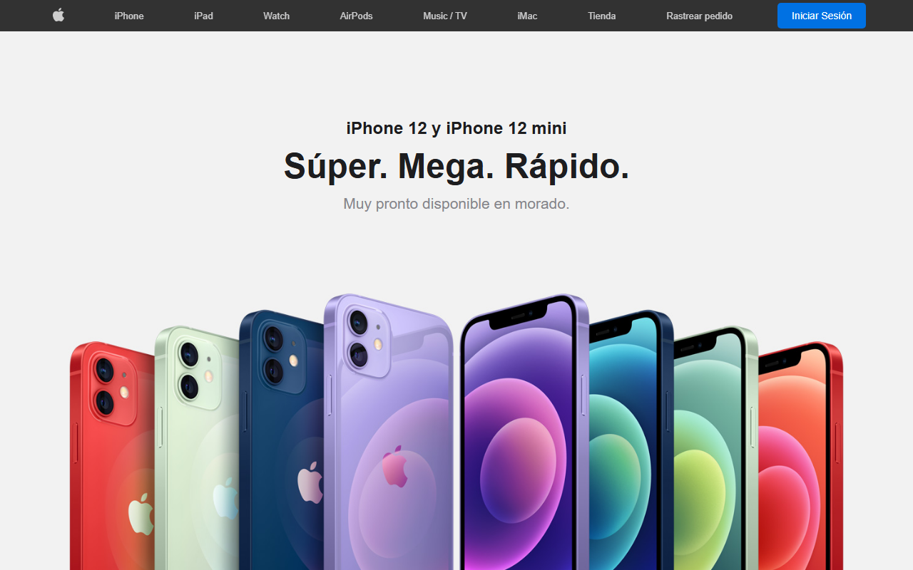 | 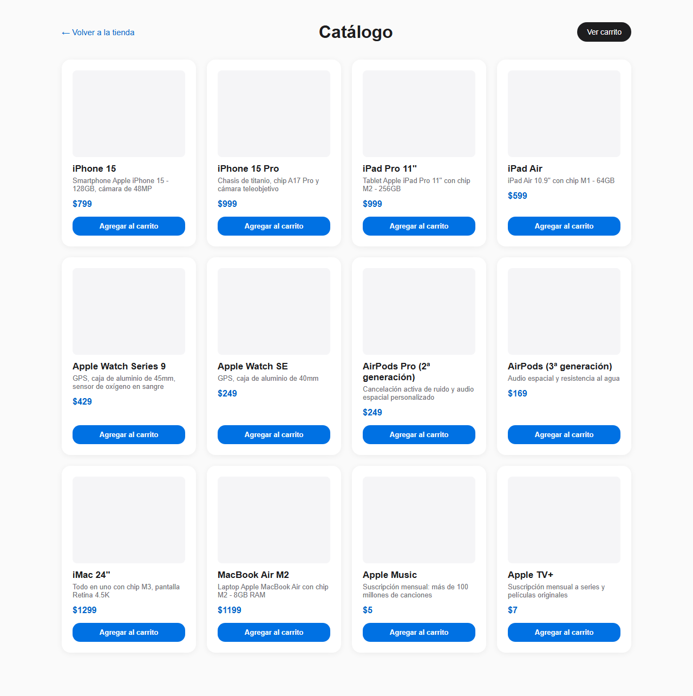 |

| Vista rápida de producto (modal) | Inicio de sesión / registro |
|---|---|
| 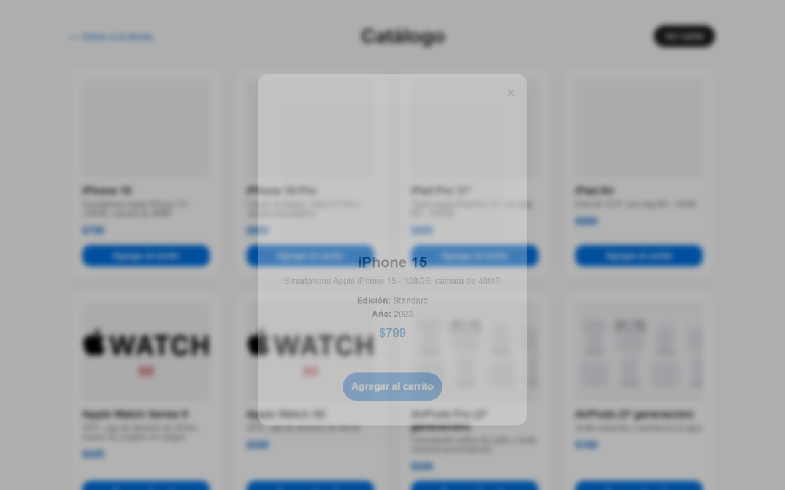 | 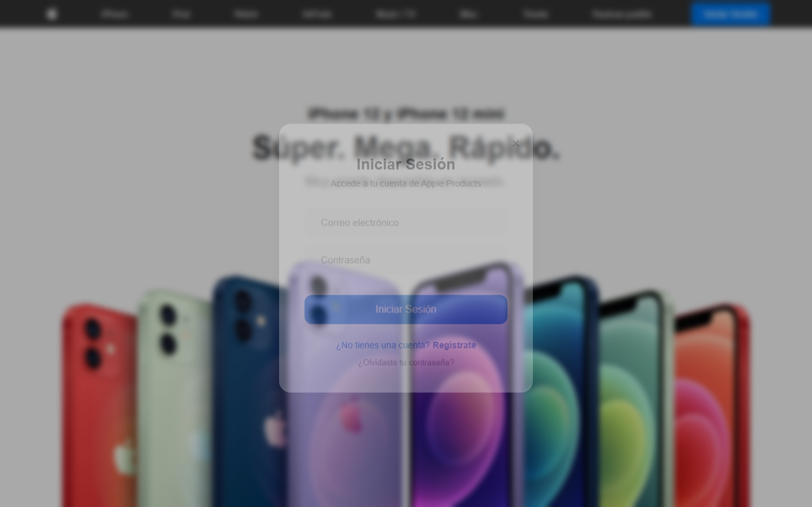 |

### Compra y seguimiento

| Carrito + checkout | Confirmación de pedido |
|---|---|
| 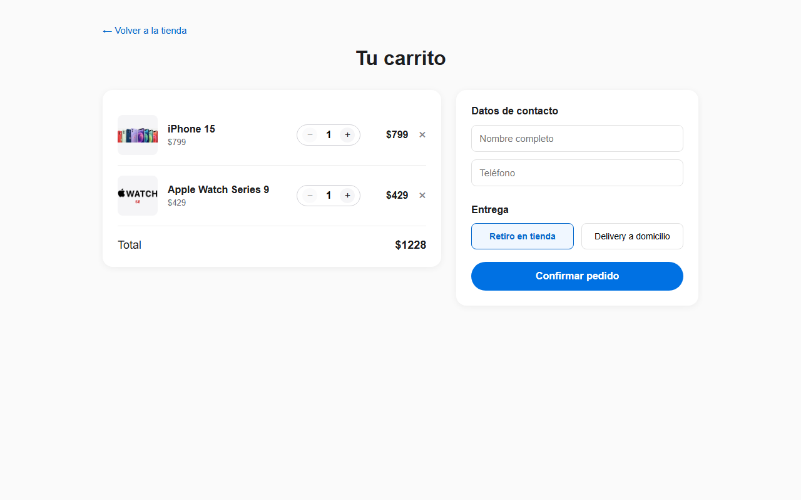 |  |

| Mis pedidos (cuenta logueada) | Rastrear pedido (sin cuenta) |
|---|---|
| 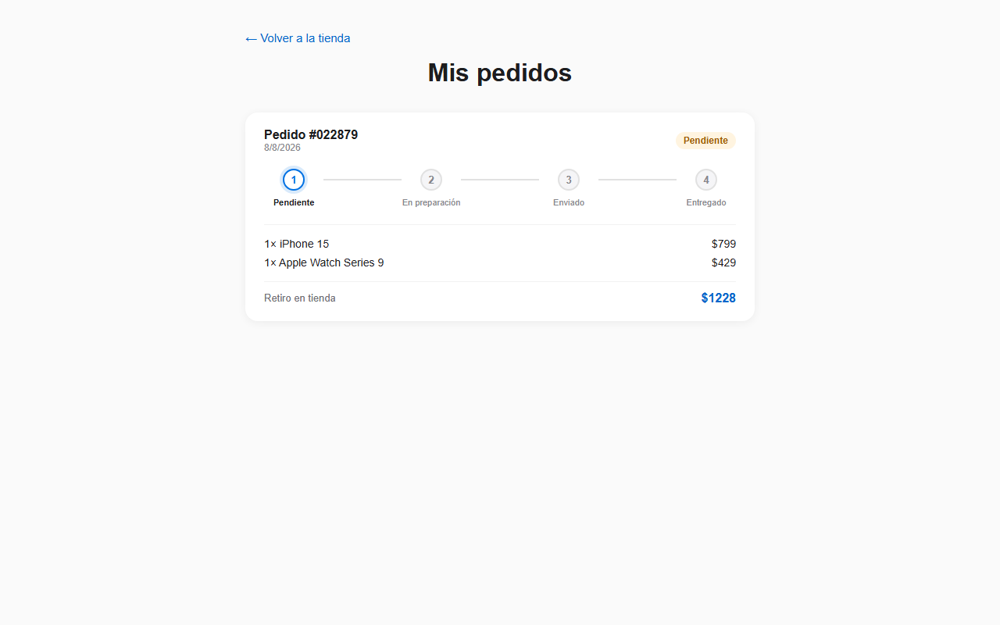 | 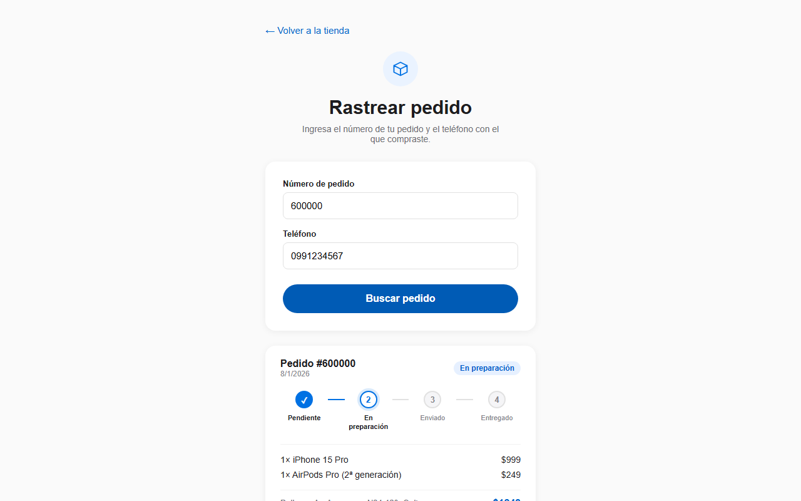 |

### Panel administrativo

| Gestión de pedidos | Gestión de productos |
|---|---|
| 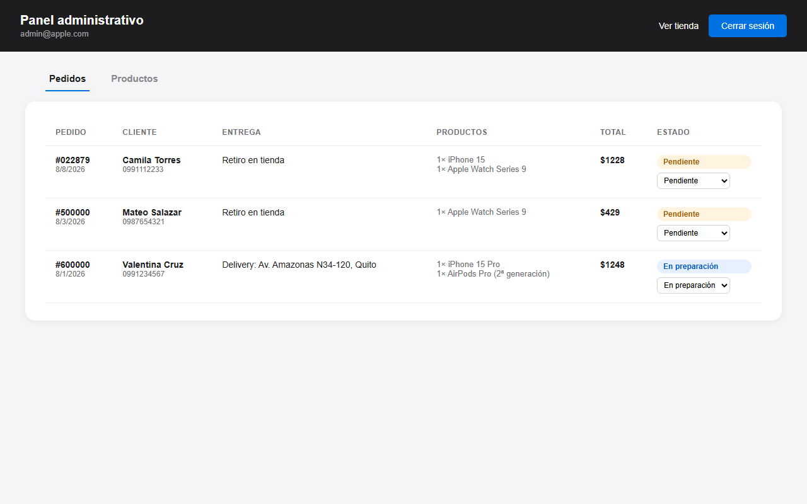 | 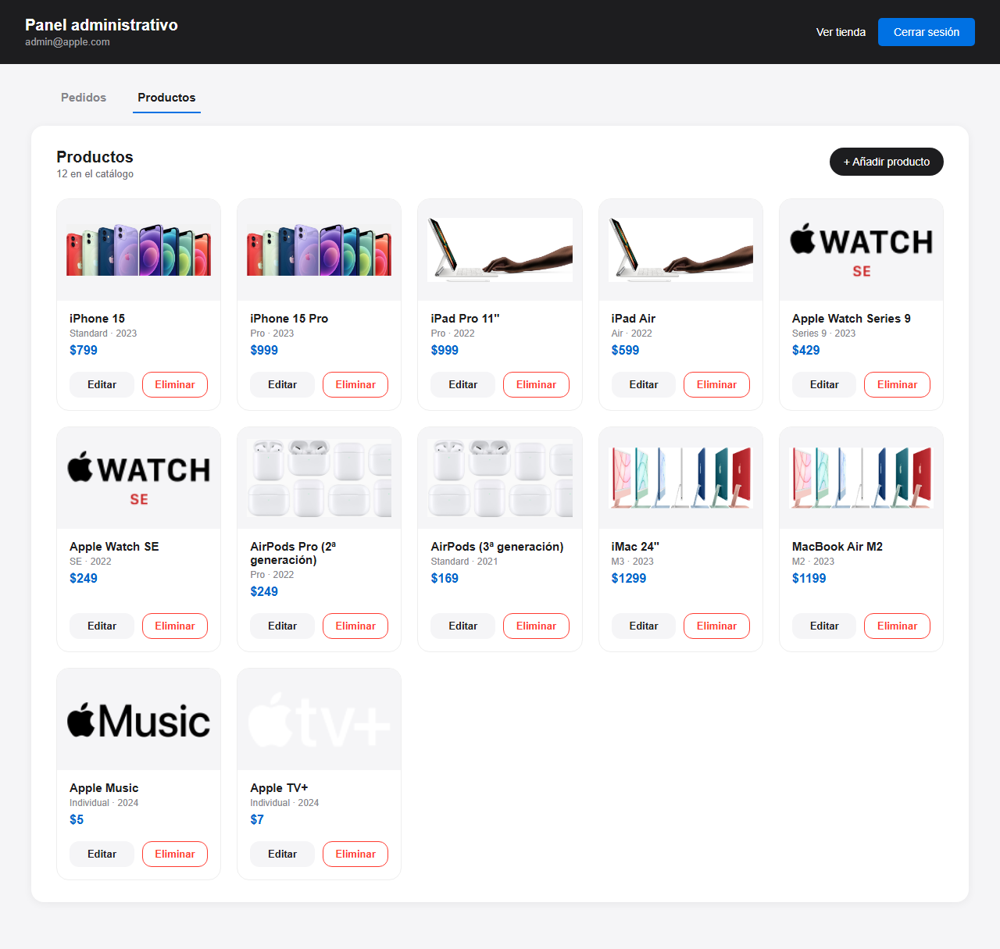 |

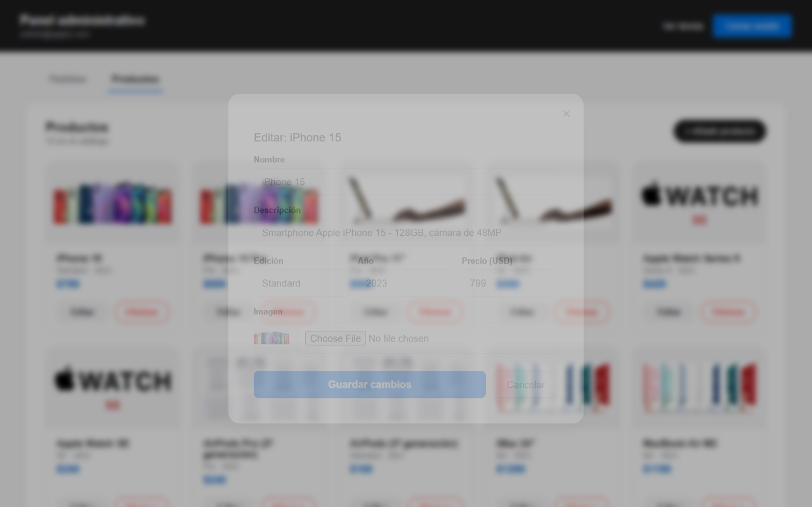

### Responsive

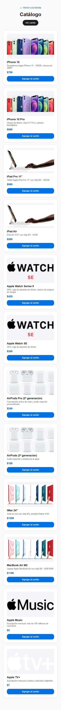

## 3. Stack tecnológico

**Frontend (lo que está desplegado):**
- React 18 + React Router 6
- Create React App (`react-scripts`) como toolchain de build
- Context API para estado global (sesión y carrito)
- CSS puro por componente (sin framework de UI de terceros)
- Jest + React Testing Library para pruebas unitarias

**Backend (incluido en el repo, para desarrollo local / evolución futura):**
- Node.js + Express
- MongoDB + Mongoose
- JWT / bcrypt para autenticación (esquema ya definido en el modelo de usuario)

**Infraestructura y entrega continua:**
- GitHub Actions: build y despliegue automático a GitHub Pages en cada
  push a `main`
- Doble despliegue: GitHub Pages y Vercel, ambos sirviendo el mismo build
- Vercel: rewrites configurados para SPA (`vercel.json`) y build por SPA con
  rutas propias vía `PUBLIC_URL`

## 4. Arquitectura y patrones aplicados

- **Capa de servicios (Service Layer) como frontera de datos.** Ningún
  componente llama a `fetch` o a `localStorage` directamente — todo pasa por
  `productoService`, `AuthService` y `orderService`. Todas las funciones
  devuelven la misma forma (`{ data: { ... } }`) que devolvería una API
  real, así que el día que exista un backend propio desplegado, solo hace
  falta reescribir estos tres archivos: **ningún componente cambia**.
- **Arquitectura por capas (frontend):** UI (componentes) → servicios
  (acceso a datos) → persistencia (`localStorage` hoy, API mañana). Mismo
  principio que separa capa de presentación, lógica de negocio y acceso a
  datos en una arquitectura de N capas tradicional.
- **Atomic Design** (atoms → molecules → organisms → pages) aplicado a las
  dos features más nuevas (`cart/` y `admin/`), como referencia de cómo
  escalar el resto del proyecto con esa misma estructura.
- **Control de acceso basado en roles (RBAC):** dos roles reales
  (`admin` / `cliente`) derivados de la sesión, cada uno con su propia
  superficie de la aplicación — el panel administrativo, el checkout y "mis
  pedidos" están gateados por rol, no solo ocultos visualmente.
- **Patrón Provider / Context API** para estado compartido entre
  componentes sin prop-drilling (`AuthContext`, `CartContext`), cada uno con
  una responsabilidad única.
- **MVC en el backend:** `routes` (qué endpoint existe) → `controllers`
  (qué hace) → `models` (cómo se guarda), el patrón clásico de Express.
- **Principio de responsabilidad única:** por ejemplo, la separación del
  panel de administración (`/admin`) del catálogo público evitó que
  `ProductoList` tuviera que conocer roles de sesión; el detalle de producto
  es un modal de "vista rápida" en vez de una página aparte, reduciendo el
  árbol de rutas a lo que realmente se usa.
- **Diseño responsive** verificado en móvil / tablet / escritorio, con
  media queries dedicadas donde el layout por defecto no alcanzaba (nav
  colapsado en pantallas angostas, grillas de producto adaptables).
- **CI/CD:** pipeline de GitHub Actions como automatización real de
  despliegue (no un paso manual), con verificación de build reproducible.

## 5. Funcionalidades principales

- Catálogo de productos con imágenes, precio, edición y año
- Vista rápida de producto (modal) con "Agregar al carrito"
- Carrito persistente (localStorage) con edición de cantidades
- Checkout con datos de contacto y tipo de entrega (retiro / delivery)
- Registro e inicio de sesión con roles diferenciados
- Historial de pedidos por cuenta ("Mis pedidos")
- Rastreo público de pedidos por número + teléfono (sin necesitar cuenta)
- Panel administrativo: gestión de pedidos (cambio de estado) y productos
  (alta, edición con vista previa de imagen, baja)
- Despliegue automático (GitHub Actions) a dos plataformas distintas
